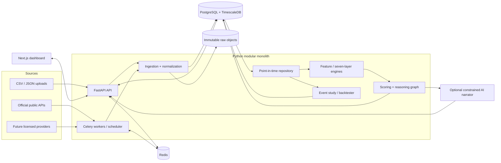

# Architecture Proposal

## 1. Decision summary

Build Phase 1 as a **modular monolith** deployed as three processes:

1. a FastAPI HTTP API;
2. a Celery worker and scheduler using the same Python domain package; and
3. a Next.js web application.

PostgreSQL is the system of record, TimescaleDB accelerates time-series workloads,
Redis brokers background jobs and short-lived cache entries, and an immutable raw
object abstraction retains original CSV/JSON inputs. The local implementation uses
a Docker volume; the interface can later target licensed object storage.

This is deliberately not a microservice system. Domain boundaries are enforced in
code and database access, while deployment remains simple enough for a reliable MVP.

## 2. Business interpretation of the reference book

The book describes an ordered causal chain:

```text
new information
  -> expectations change
  -> institutions adjust or hedge positions
  -> aggressive orders consume liquidity
  -> price structure changes
```

It then requires a decision chain:

```text
regime -> pricing -> positioning -> catalyst -> session
       -> cross-market confirmation -> execution and risk
```

The application therefore does not treat the seven layers as seven interchangeable
votes. They have different roles:

| Layer | System responsibility | May do |
|---|---|---|
| 1. Regime | Slow-moving directional background | Contribute to macro bias |
| 2. Expectations | Identify what changed versus what was priced | Contribute to direction and identify repricing |
| 3. Positioning | Identify vulnerability and likely amplification | Contribute when a flow is observed; otherwise modify asymmetry/risk |
| 4. Catalysts | Identify new information and event risk | Affect direction after release; reduce execution confidence before release |
| 5. Sessions/liquidity | Identify active participants and execution conditions | Confirm/reject moves and modify confidence/slippage risk |
| 6. Cross-market | Test the proposed causal explanation | Confirm, contradict, or identify an alternative driver |
| 7. Execution/risk | Decide whether a bias is currently actionable | Gate entry state; never manufacture a trade from bias alone |

Price-plus-open-interest combinations such as “price up and open interest down” are
stored as `INFERRED` probable short covering, not as an observed trader action.

### Implemented canonical decision

The runtime ruleset is `gold-reference-book-7-layer-v1`; its persisted aggregate is
`gold-reference-book-7-layer-v1-decision-v1`. Layers 1–4 and 6 supply signed
directional evidence. Layer 5 supplies session, liquidity, and price-acceptance
gates. Layer 7 separates bias, trigger, invalidation, and risk and can force
`WAIT`, but cannot turn a macro view into a trade. Stable factor coverage, live
usable coverage, and directional-component coverage are distinct measurements.
See `BOOK_ALIGNMENT.md` for the factor-by-factor implementation boundary.

## 3. Goals and boundaries

### Phase 1 goals

- Ingest XAUUSD one-minute OHLCV from CSV and aggregate supported timeframes.
- Ingest the required yield, inflation, labour, policy, dollar, and COT series from
  CSV/JSON plus selected public adapters.
- Preserve raw payloads and every normalized revision.
- Calculate deterministic market structure, sessions, features, signals, scores,
  explanations, and data-health status.
- Expose all seven layers. A layer with unavailable data is visibly `UNKNOWN`.
- Run point-in-time event studies and explicit-rule strategy backtests.
- Provide Executive, Macro, Events, Positioning, Sessions/Structure,
  Cross-Market, Backtest, and Data Health views.
- Start from Docker Compose and load a clearly labelled demo dataset without manual
  database edits or paid credentials.

### Explicit Phase 1 non-goals

- Automated order placement, trading-account mutation, or live portfolio
  management. Read-only broker market-data access is permitted.
- Claims of observed institutional intent from anonymous market data.
- Unlicensed real-time COMEX, options, DXY, LBMA benchmark, ETF, or consensus data.
- Dealer-gamma estimation without sufficient options data.
- An opaque ML model or an AI-authored signal.
- Tick-accurate execution simulation where only OHLC bars exist.
- Production multi-tenant identity management. The architecture provides principal,
  role, and audit interfaces; a development principal is used locally.

## 4. Main assumptions

1. **Primary Phase 1 instrument:** `XAUUSD` via user-supplied/demo one-minute CSV or
   the read-only IC Markets MT5 bridge. This avoids pretending that one spot feed
   represents the entire OTC market and avoids continuous-futures roll artefacts in
   the first slice.
2. **Dollar proxy:** the Federal Reserve nominal broad dollar index is the public
   default. DXY remains an optional licensed provider implementation.
3. **Forecasts:** consensus forecasts are manually uploaded with an explicit
   `available_at` timestamp. A future licensed forecast adapter can replace manual
   entry without changing the domain model.
4. **Fed expectations:** Phase 1 accepts manual JSON/CSV snapshots and real Atlanta
   Fed quarterly SOFR distributions. It does not scrape or relabel CME FedWatch;
   exact meeting probabilities require the licensed adapter.
5. **Sessions:** initial conventions are configurable local-time templates:
   `08:00-17:00 Asia/Tokyo`, `08:00-17:00 Europe/London`, and
   `08:00-17:00 America/New_York`. Overlap is calculated from actual UTC intervals.
   The daily rollover default is 17:00 New York time. These are conventions, not
   universal market facts, and can be changed without code.
6. **Benchmark windows:** LBMA auction markers use 10:30 and 15:00
   `Europe/London`; the highlighted window width is configuration.
7. **Daily data availability:** a date-only observation is not assumed available at
   midnight. The adapter supplies or conservatively derives publication time and
   raises a quality warning when precision is limited.
8. **Confidence:** Phase 1 confidence is a transparent evidence-quality score, not a
   calibrated probability of profit. Calibration requires out-of-sample evidence.
9. **Demo data:** synthetic values are tagged `is_synthetic=true` everywhere and are
   useful only for product validation, never performance claims.

## 5. System context



## 6. Bounded modules

### Catalog and provenance

Defines providers, instruments, series, units, calendars, licenses, and immutable
ingestion manifests. It owns source identifiers and lineage, not business signals.

### Ingestion and normalization

Adapters emit a common envelope containing the raw payload, source record key,
observation period, source publication time, and ingestion time. Validation happens
before normalization. The content hash and provider key make retries idempotent.

### Market and macro data

Owns OHLCV bars, versioned numeric observations, forecasts, economic events, release
values, COT reports, and other positioning observations. It exposes only
point-in-time queries to analytics and research code.

### Sessions and market structure

Materializes session instances from IANA time zones and exchange/market calendars.
It calculates swings, trend sequences, ranges, breaks, acceptance, rejection,
compression, expansion, displacement, and retests with versioned parameters.

### Seven-layer analytics

Transforms eligible observations into derived features and epistemically labelled
signals. Each layer returns facts, unknown requirements, supporting evidence,
contradictions, and freshness—not only a number.

### Scoring and explanation

Applies versioned driver budgets, correlation groups, reaction-function weights,
caps, and confidence penalties. It writes the exact contribution of every signal and
a structured causal reasoning graph. See [SCORING_ENGINE.md](SCORING_ENGINE.md).

### Research

Runs an event-study engine and an event-driven strategy simulator against the same
point-in-time repository used by live calculations. See
[BACKTESTING.md](BACKTESTING.md).

### Presentation and administration

Exposes stable Pydantic response contracts, async job status, data health, and audit
events. The web app consumes only API contracts; it does not query the database.

### Optional AI narrator

Receives a closed structured fact bundle. It may paraphrase existing claims but may
not create a number, signal, causal edge, or trade instruction. Each sentence stores
the IDs of facts that support it. A deterministic narrator remains the default.

## 7. Processing flow

1. Receive a file or fetch result and calculate SHA-256.
2. Write the original object and an immutable ingestion manifest.
3. Parse records into a staging envelope and validate schema, unit, ordering,
   timezone, numerical ranges, and duplicates.
4. Append raw record rows even when normalization later fails.
5. Normalize valid rows into append-only versioned observations or bars.
6. Emit data-quality issues for gaps, stale data, ambiguous availability, outliers,
   or conflicting duplicates.
7. Run feature jobs at a declared `calculation_as_of` time using the point-in-time
   repository.
8. Run layer rules, persist signals and their evidence, then score them with an
   immutable ruleset version.
9. Persist a score snapshot, reasoning graph, confirmation requirements, and
   invalidation requirements.
10. Serve the snapshot through the API and invalidate only relevant cache keys.

Celery delivery is at least once. Every task accepts a deterministic idempotency key;
database uniqueness constraints make a retry safe.

## 8. Point-in-time correctness contract

All timestamps are timezone-aware UTC in storage. Human/session time zones are IANA
names such as `Europe/London`; fixed UTC offsets are not used for recurring windows.

Every fact distinguishes:

- the period it describes (`observation_start`, `observation_end`);
- when the source published it (`source_published_at`);
- when the market could first know it (`available_at`);
- when this system received it (`ingested_at`);
- its vintage/revision identity; and
- an optional superseded record, without updating or deleting the old row.

At simulated time `T`, a query may select only rows where `available_at <= T`. For a
natural observation key it selects the latest version among those eligible rows.
Production replay can additionally enforce `ingested_at <= T`; historical research
uses source availability plus configured provider latency. Both modes are recorded.

Special rules:

- COT Tuesday observations remain unavailable until the actual Friday/holiday-shifted
  publication timestamp.
- A forecast snapshot must predate its event release; later forecasts cannot replace
  the one used in a historical surprise.
- Revisions create new observation rows at their own availability times.
- A swing pivot is not known on the pivot bar: it becomes available only after the
  configured right-hand confirmation bars have closed.
- Bar-derived signals use closed bars only. A close decision fills no earlier than
  the next eligible price after latency and transaction costs.

The detailed schema is in [DATA_MODEL.md](DATA_MODEL.md).

## 9. Deterministic market-structure design

Each detector implements `detect(bars_as_of, config_version) -> detections[]` and
returns timestamp, price/range, timeframe, method, confidence, evidence, detection
time, and invalidation condition.

- **Swings:** symmetric pivot window plus a configurable minimum ATR/prominence.
  Detection time is the close of the last right-side confirmation bar.
- **Trend:** confirmed swing sequences (`HH/HL` or `LL/LH`) with a minimum movement
  threshold. Anything else is range/transition, not a forced trend label.
- **Support/resistance:** clusters confirmed swing levels within an ATR or absolute
  tolerance; minimum touches and last-touch decay are configured.
- **Break of structure:** a closed-bar break of a qualifying swing in the direction
  of the established sequence, beyond a configurable buffer.
- **Market-structure shift:** failure of the prior sequence followed by a qualifying
  opposite break. It is evidence of possible change, not a reversal guarantee.
- **Acceptance:** configurable count or duration of closes beyond a reference level,
  with optional range/volume participation evidence.
- **Rejection/failed breakout:** excursion beyond a level followed by a close back
  inside within a maximum number of bars. A trapped-breakout label also requires a
  prior breakout trigger and adverse return through the level.
- **Compression/expansion:** rolling true-range/ATR percentile and overlap measures.
- **Displacement:** body and true-range multiples of lagged ATR plus limited overlap.
- **Momentum/retest:** normalized slope/return and a revisit to a broken zone that
  holds or fails under explicit tolerance and time limits.

Supported configurations are 1 minute, 5 minutes, 15 minutes, 1 hour, 4 hours, and
daily. No detector relies on an informal chart-pattern name.

## 10. Runtime and deployment topology

Docker Compose will provide:

| Service | Responsibility |
|---|---|
| `postgres` | PostgreSQL plus TimescaleDB |
| `redis` | Celery broker/result backend, rate-limit counters, short cache |
| `api` | FastAPI and generated OpenAPI |
| `worker` | ingestion, features, scoring, studies, backtests |
| `scheduler` | periodic public-adapter and health jobs |
| `web` | Next.js application |

The API and worker use the same container image and Python package but different
entry points. Migrations run as an explicit one-shot service, not concurrently from
every application replica. Health endpoints distinguish process liveness from
database/Redis readiness.

Configuration uses environment variables for infrastructure and secrets, plus
version-controlled YAML for non-secret rule defaults. Every activated analysis
configuration is copied into an immutable database version with a content hash.

## 11. Proposed repository structure

```text
.
|-- README.md
|-- BOOK_ALIGNMENT.md
|-- ARCHITECTURE.md
|-- DATA_MODEL.md
|-- DATA_SOURCES.md
|-- SCORING_ENGINE.md
|-- BACKTESTING.md
|-- API_DESIGN.md
|-- DASHBOARDS.md
|-- MILESTONES.md
|-- Gold_USD_Market_Intelligence_Reference_Book.pdf
|-- .env.example
|-- .gitignore
|-- docker-compose.yml
|-- Makefile
|-- backend/
|   |-- pyproject.toml
|   |-- alembic.ini
|   |-- migrations/
|   |-- src/gold_intel/
|   |   |-- api/                 # FastAPI routes, dependencies, schemas
|   |   |-- application/         # use cases and transaction boundaries
|   |   |-- domain/              # entities, values, ports, rules
|   |   |-- infrastructure/      # SQLAlchemy, Redis, raw-object store
|   |   |-- ingestion/           # adapters, parsers, normalization
|   |   |-- analytics/
|   |   |   |-- regime/
|   |   |   |-- expectations/
|   |   |   |-- positioning/
|   |   |   |-- catalysts/
|   |   |   |-- sessions/
|   |   |   |-- cross_market/
|   |   |   |-- execution/
|   |   |   |-- structure/
|   |   |   `-- scoring/
|   |   |-- research/            # event study and strategy simulator
|   |   |-- narration/           # deterministic and optional AI narrator
|   |   `-- tasks/               # Celery entry points
|   `-- tests/
|       |-- unit/
|       |-- integration/
|       |-- contract/
|       |-- data_quality/
|       `-- backtest_correctness/
|-- frontend/
|   |-- package.json
|   |-- src/app/                 # route groups for eight dashboards
|   |-- src/components/
|   |-- src/lib/                 # typed API client and formatters
|   `-- tests/
|-- config/
|   |-- scoring/
|   |-- structure/
|   |-- sessions/
|   `-- data_quality/
|-- data/
|   |-- schemas/                 # documented CSV/JSON contracts
|   `-- samples/                 # small, deterministic, synthetic fixtures
|-- scripts/                     # seed and developer operations
|-- infra/
|   `-- docker/
|-- docs/
|   |-- operations.md
|   |-- api.md
|   `-- decisions/               # architecture decision records
`-- .github/workflows/
    |-- backend.yml
    `-- frontend.yml
```

## 12. API and dashboard boundaries

The initial routes and response contracts are in [API_DESIGN.md](API_DESIGN.md).
Dashboard wireframes are in [DASHBOARDS.md](DASHBOARDS.md). Both use the same rule:
the UI renders server-authored structured evidence and does not recalculate scores.

## 13. Security, observability, and quality

- Pydantic validates external payloads; database checks enforce score and OHLC
  ranges, uniqueness, and referential integrity.
- A principal-provider dependency supports future OIDC/JWT. Development mode emits
  a named local principal; no route silently bypasses audit attribution.
- Roles are expressed as policy names (`viewer`, `researcher`, `data_operator`,
  `admin`) even before a production identity provider is connected.
- Redis-backed per-principal and per-IP limits protect uploads and expensive jobs.
- `httpx` plus bounded exponential backoff handles retryable provider errors.
- JSON logs carry request/job IDs, provider, dataset, ruleset, and calculation run.
- Metrics cover data latency, ingestion failures, queue age, calculation duration,
  stale series, API latency, and backtest duration.
- Audit events record configuration activation, manual data uploads, saved research
  definitions, and optional AI narration requests.
- CI runs format/lint/type checks, unit tests, migration tests, integration tests,
  frontend tests, and point-in-time correctness tests.

## 14. Key risks and mitigations

| Risk | Consequence | Mitigation |
|---|---|---|
| Reliable consensus forecasts are generally licensed | Event surprises cannot be reconstructed honestly | Manual timestamped forecasts in Phase 1; licensed adapter later; otherwise event marked `UNKNOWN` |
| Spot gold is fragmented | One broker feed can be mistaken for the whole market | Store venue/provider identity and never label spot volume as global volume |
| Public yields and dollar series are daily/delayed | False intraday confirmation | Expose source granularity, use conservative availability, lower quality for event-time use, accept licensed intraday adapters later |
| COT holiday releases differ from the normal Friday schedule | Look-ahead bias | Store actual publication timestamps and test delayed weeks |
| Macro revisions replace first-release values at many sources | Historical leakage | Append vintages and query by `available_at`; ALFRED-style adapter and revision tests |
| Session definitions vary by convention/provider | Misleading session labels | Versioned local-time templates and visible configuration; DST fixture tests |
| Continuous futures can contain roll gaps | False signals/backtest returns | Phase 1 primary instrument is XAUUSD; contract-aware futures and explicit roll policies before futures strategies |
| Dynamic weights invite overfitting | Attractive but unstable results | Small named reaction-function profiles, immutable versions, walk-forward and sensitivity reports |
| Synthetic demo data looks real | Invalid performance claims | Persistent synthetic badge, metadata flag, and blocked mixing with production studies by default |
| Celery retries duplicate writes | Corrupted counts and scores | Content hashes, deterministic keys, unique constraints, and transaction-scoped upserts of references only—not raw facts |
| AI prose adds unsupported claims | Hallucinated market intelligence | Closed fact bundle, claim-to-evidence validation, stored input hash, deterministic default |

## 15. Information intentionally deferred

Implementation can begin without these decisions, but they are required before a
live production launch:

- the licensed gold/intraday cross-market vendor and redistribution rights;
- the preferred institutional consensus and Fed-path provider;
- the exact broker/session and rollover conventions for the intended user;
- portfolio currency, account-risk defaults, and cluster limits; and
- production identity provider and retention policy.

No architecture rewrite is required for those choices because each is represented by
a provider, configuration, or policy interface.
