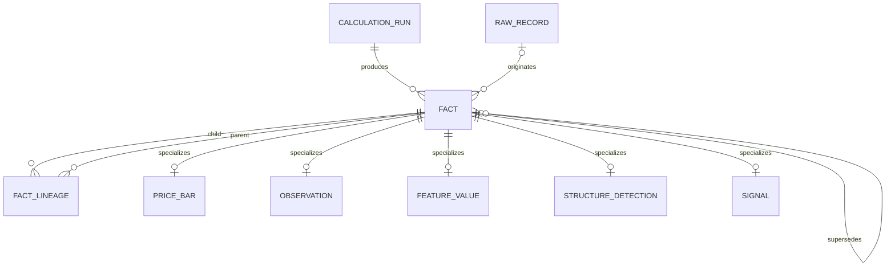
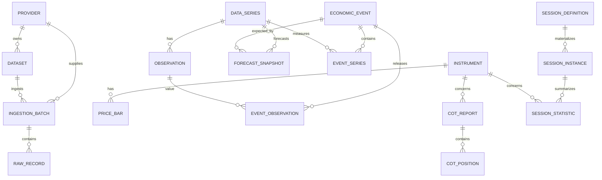
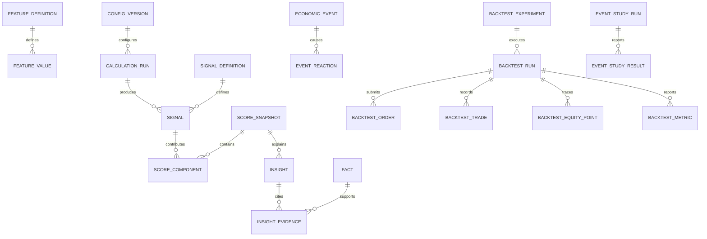

# Data Model

## 1. Model objectives

The schema must answer two questions for every conclusion:

1. **What does this fact describe?**
2. **When could the market and this system have known it?**

It must also reconstruct the exact raw record, derived inputs, code/rule version,
and reasoning path behind any displayed score or historical result.

PostgreSQL schemas provide module boundaries:

- `catalog`: providers, datasets, instruments, series, and calendars;
- `raw`: immutable ingestion manifests and source records;
- `market`: normalized observed market, macro, event, and positioning data;
- `analytics`: calculation runs, facts, lineage, features, signals, and scores;
- `research`: event studies and strategy backtests; and
- `ops`: jobs, quality issues, audit events, and authorization-ready principals.

## 2. Common conventions

- Primary keys are UUIDs; externally meaningful codes also have unique constraints.
- Every timestamp is PostgreSQL `timestamptz` and normalized to UTC.
- Recurring local-time rules retain an IANA zone name separately.
- Prices and source economic values use bounded `numeric`; intermediate statistics
  may use `double precision` with finite-value checks.
- Units are explicit. A value is never compared with another series until a declared
  transformation puts them into compatible units.
- Raw and fact tables are append-only to the application role. Corrections append a
  new row with `supersedes_fact_id`; they do not update history.
- Mutable status rows such as job progress are operational state, not market facts.
- All externally supplied records include provider, dataset, source key, payload
  hash, parser version, and ingestion batch.
- `is_synthetic` propagates from source batch through facts, scores, and research
  runs. Mixed synthetic/real research is rejected by default.

### Epistemic status

```text
OBSERVED    directly received from a declared source
CALCULATED  mathematical transformation of observed/calculated facts
INFERRED    interpretation that is plausible but not directly observable
UNKNOWN     required information is absent, stale beyond policy, or unreliable
```

An `UNKNOWN` signal still has all required signal fields: direction `0`, strength
`0`, confidence `0`, a data-quality/freshness assessment, and an explanation of the
missing or rejected input. It never contributes directional points.

## 3. Temporal contract

All normalized facts share these concepts:

| Field | Meaning |
|---|---|
| `effective_start_at` / `effective_end_at` | Period or instant the value describes |
| `source_published_at` | Timestamp declared by the publisher |
| `available_at` | Earliest timestamp the market could reasonably know the record |
| `ingested_at` | Timestamp this installation received it |
| `vintage_date` | Publisher vintage identifier/date, when applicable |
| `revision_no` | Monotonic version within the natural observation key |
| `supersedes_fact_id` | Prior version replaced by this newly published version |

`available_at` is mandatory for an eligible fact. If the source offers only a date,
the adapter applies a documented conservative time policy and records a
`DQ_IMPRECISE_AVAILABILITY` issue.

### Point-in-time selection

For simulated clock `T`:

```sql
eligible := available_at <= T
selected := latest eligible revision per natural observation key
```

Live-decision replay optionally adds `ingested_at <= T`. The chosen knowledge mode
and provider-latency model are stored on every research run.

An observation's period date alone never makes it eligible. In particular, a COT
Tuesday observation is unavailable until its actual publication timestamp, and a
macro revision is unavailable until the revision release.

## 4. Lineage spine

Rather than using unvalidated polymorphic evidence IDs, every normalized or derived
item registers an `analytics.fact`. Specialized tables have a one-to-one foreign key
to that fact.



`fact_lineage(child_fact_id, parent_fact_id, relation)` uses relations including
`DERIVED_FROM`, `SUPPORTS`, `CONTRADICTS`, `CONFIRMS`, and `INVALIDATES`. A cycle
check is enforced in the application service; direct self-links are rejected by a
database check.

## 5. Source and normalized-data ER diagram



## 6. Analytics and research ER diagram



## 7. Proposed entities

### 7.1 Catalog

#### `catalog.providers`

`id`, unique `code`, `name`, `provider_type`, `base_url`, `license_class`,
`redistribution_allowed`, `attribution_text`, `active`, timestamps.

No secret is stored here. Environment-secret names may be referenced by adapter
configuration, but values remain outside the database.

#### `catalog.datasets`

`id`, `provider_id`, unique `(provider_id, provider_code)`, canonical name, domain,
frequency, source timezone, expected publication policy, schema version, terms URL,
and `is_paid`.

#### `catalog.instruments`

`id`, unique `code`, instrument type (`SPOT`, `FUTURE`, `INDEX`, `ETF`), base and
quote units, venue, tick size, contract multiplier, calendar ID, and active dates.
Futures also carry root symbol and expiry metadata in a child
`catalog.futures_contracts` table.

#### `catalog.data_series`

`id`, dataset, canonical code, provider code, title, domain, unit, native frequency,
seasonal-adjustment flag, higher-is interpretation metadata, and expected staleness.
Unique `(dataset_id, provider_code)` prevents accidental duplication.

#### `catalog.trading_calendars`

Calendar code, IANA zone, business-day rules, holidays, early closes, and version.
Exceptions are rows rather than hard-coded date checks.

### 7.2 Immutable source ingestion

#### `raw.ingestion_batches`

`id`, provider/dataset, adapter name and version, parser version, original object key,
SHA-256, byte count, received time, declared source publication time, status, record
counts, error summary, `is_synthetic`, and initiating principal.

Unique `(provider_id, dataset_id, sha256)` makes identical uploads idempotent. A new
parser may normalize the same immutable batch again under a new calculation run.

#### `raw.raw_records`

`id`, `batch_id`, source record key, row number, JSONB payload, payload hash,
source-published timestamp if present, ingested timestamp, and parse status.
Unique `(batch_id, row_number)` and `(batch_id, source_record_key, payload_hash)`
protect retries while allowing a source to publish a changed version.

### 7.3 Facts and calculation runs

#### `analytics.config_versions`

`id`, config type, semantic name/version, canonical JSONB content, SHA-256, creator,
created time, active-from time, and optional retired time. Content becomes immutable
once activated.

#### `analytics.calculation_runs`

`id`, engine name/version, code commit, config version, requested `as_of`, knowledge
mode, provider-latency model, data watermark, status, start/end timestamps, input
fact count, and error details.

#### `analytics.facts`

`id`, fact kind, epistemic status, temporal fields from section 3, source record,
producing calculation run, superseded fact, data-quality score, `is_synthetic`, and
canonical content hash. Checks enforce quality in `[0,100]` and prevent an observed
fact from naming a calculation run as its sole origin.

#### `analytics.fact_lineage`

Child fact, parent fact, relation, ordinal, and optional role/explanation. Primary key
`(child_fact_id, parent_fact_id, relation)`.

### 7.4 Prices and generic observations

#### `market.price_bars`

`fact_id`, instrument, provider, timeframe, bar open/close, open/high/low/close,
optional volume, volume type (`EXCHANGE`, `TICK`, `UNKNOWN`), optional bid/ask/spread,
currency, source sequence, and completeness state.

Checks enforce positive prices, `high >= greatest(open, close, low)`,
`low <= least(open, close, high)`, non-negative volume/spread, and
`bar_close_at > bar_open_at`. The natural version key is instrument, provider,
timeframe, and bar-open time; versions remain append-only through their facts.

The current Phase 1 projection stores the IC Markets MT5 spread as
`spread_points` and `spread_price`. The conversion is provider-contract specific:
the validated contracts use `XAUUSD=0.01`, `EURUSD=0.00001`, `XAGUSD=0.001`,
`US500=0.01`, and `TLT.NAS=0.01`. Unversioned providers cannot submit point
spreads. Historical normalized rows are enriched from immutable
`raw.raw_records`, so the original payload remains unchanged. MT5 `tick_volume`
continues to carry `volume_type=TICK` and is never promoted to exchange volume.

Exact file retries are idempotent by provider, dataset, and content hash.
Differently chunked overlapping price files retain their raw batches but use
`ON CONFLICT DO NOTHING` on the immutable normalized fact key
`(provider, instrument, timeframe, open_time, available_at)`. No existing price
fact is overwritten.

#### `market.observations`

`fact_id`, series, numeric/text value (exactly one), observation start/end, unit,
frequency, vintage date, revision number, seasonal-adjustment state, and source
flags. This table holds yields, dollar proxies, macro series, open interest, ETF
flows, central-bank data, and other provider-defined time series when no richer
domain table is required.

### 7.5 Economic events and forecasts

#### `market.economic_events`

`id`, stable event key, event type, country, title, scheduled timestamp, actual
release timestamp, importance `[0,100]`, status (`SCHEDULED`, `RELEASED`,
`CANCELLED`, `UNSCHEDULED`), source, event timezone, and metadata. Duplicate
provider events are mapped to one canonical event through an alias table.

#### `market.event_series`

Event, series, component role (`HEADLINE`, `CORE`, `WAGES`, `UNEMPLOYMENT`, etc.),
display order, and reaction-function orientation. Primary key `(event_id, series_id)`.

#### `market.forecast_snapshots`

An observed `fact_id`, event, series, provider, consensus, optional high/low/count,
unit, and snapshot `available_at`. Multiple snapshots are retained. A database check
requires availability before a released event for use as a pre-event consensus;
late rows remain stored but are ineligible for surprise calculations.

#### `market.event_observations`

Event, observation fact, release role (`INITIAL`, `REVISION`, `COMPONENT`), and the
previous value displayed in that release. It keeps the contemporaneous “previous”
separate from the latest revised history.

Economic surprise is a versioned feature, not a mutable event column. Its lineage
links the exact forecast, actual observation, prior observation, and revision facts.

### 7.6 Positioning

#### `market.cot_reports`

`id`, observed fact, instrument/market code, report type, futures-only/combined flag,
Tuesday observation date, actual publication timestamp, report week, and source
release identifier. A check enforces publication after observation; holiday-shifted
dates are expected and not synthesized from a blanket Friday rule.

#### `market.cot_positions`

Report, trader category, long/short/spreading contracts, weekly changes, percentage
of open interest, and trader counts where supplied. Primary key
`(report_id, trader_category)`. Managed-money net and historical percentile are
calculated features, never overwritten columns.

#### `market.positioning_observations`

Observed fact, instrument, metric type (`OPEN_INTEREST`, `ETF_HOLDINGS`, `ETF_FLOW`,
`CENTRAL_BANK_HOLDINGS`, `OPTION_IV`, `OPTION_STRIKE_OI`, etc.), optional strike and
expiry, value, and unit. This is the extension point for manual and licensed sources.

### 7.7 Sessions and market structure

#### `market.session_definitions`

Unique code/version, session type, IANA zone, local start/end times, applicable days,
calendar, effective dates, and parameters. Definitions are immutable after use.

#### `market.session_instances`

Definition, trading date, UTC start/end, and calendar state. Unique
`(definition_id, trading_date)`. Materializing intervals makes DST behaviour
inspectable and testable.

#### `market.session_statistics`

Calculated fact, session instance, instrument, high, low, range, opening/closing
price, bar count, expected bar count, realized volatility, mean/max spread, breakout
state, and handover state.

#### `market.structure_detections`

Calculated or inferred fact, instrument, timeframe, detection type, pivot/event
timestamp, `detected_at`, price level or zone bounds, method, confidence, evidence
JSONB, invalidation JSONB, and config version. Confidence is constrained to
`[0,100]`; zone lower bound cannot exceed upper bound.

Phase 1 currently calculates this projection on demand from immutable price bars and
returns a ruleset/config version plus input-data hash. It is not yet materialized in
the proposed three tables above. That avoids presenting a transient cache as a
source fact; persistence can be added with the same response contract when scheduled
historical precomputation is introduced.

The same response contains a `broker-liquidity-1` snapshot: current
15-minute robust spread/range/tick-activity measures, a DST-aware same-session
20-day baseline, percentiles, quality/freshness, warnings, and an execution-only
confidence multiplier.

### 7.8 Features, signals, scores, and insights

#### `analytics.feature_definitions`

Unique code/version, layer, description, output unit, expected inputs, algorithm
name/version, default decay, and valid range.

#### `analytics.feature_values`

Fact, feature definition, instrument/scope, numeric/JSONB value, calculation `as_of`,
and config version. Lineage identifies all input facts.

#### `analytics.signal_definitions`

Unique code/version, layer 1-7, driver family, description, default half-life/expiry,
direction semantics, epistemic policy, and expected evidence roles.

#### `analytics.signals`

Fact, definition, instrument/scope, timestamp, direction `[-1,1]`, strength,
confidence, freshness, data-quality score, source summary, expiry, explanation,
driver family, and status. All scores are checked in `[0,100]`. Supporting and
contradicting facts use lineage relations.

#### `analytics.score_snapshots`

`id`, fact, instrument, calculation `as_of`, overall score `[-100,100]`, bullish,
bearish, neutrality, conflict, evidence coverage, analysis confidence, execution
confidence, bias label, regime, dominant driver, main contradiction, highest-risk
assumption, upcoming catalyst, execution state, config version, and reasoning-graph
JSONB. Numerical values have database range checks.

#### `analytics.score_components`

Snapshot, signal, driver, base budget, reaction multiplier, effective weight,
pre-cap value, cap, final contribution, and exclusion/penalty reason. Primary key
`(score_snapshot_id, signal_id)`. Components make the headline score exactly
recomputable.

#### `analytics.insights`

Snapshot, insight type (`WHAT_CHANGED`, `CONFIRMS`, `CONTRADICTS`, `INVALIDATES`,
`RISK_WARNING`, etc.), text, epistemic status, generator (`DETERMINISTIC`, `AI`),
generator version, structured claim JSONB, and input hash.

#### `analytics.insight_evidence`

Insight, fact, evidence role, and ordinal. Every factual sentence must have at least
one supporting fact; AI output is rejected before persistence if this invariant
fails.

### 7.9 Event reactions and research

#### `research.event_reactions`

Calculated fact, event, instrument, horizon (`1M`, `5M`, `15M`, `1H`, `4H`,
`DAILY_CLOSE`), reference price/time, end price/time, return, MFE, MAE, first-move
direction, held/reversed flag, spread/data completeness, and calculation config.

#### `research.event_study_runs` and `event_study_results`

The run stores immutable query, date range, filters, data/config/code versions,
knowledge mode, and status. Result rows store stratum keys, observation count,
summary statistics, confidence intervals, and bootstrap seed/method.

#### `research.backtest_experiments`

User-owned saved definition: name, thesis, signal/entry/exit rules, parameter schema,
benchmark, and version. Editing creates a new version.

#### `research.backtest_runs`

Experiment version, status, requested/actual period, in-sample/out-of-sample/walk-
forward specification, virtual-clock policy, data watermark, config/code versions,
random seed, capital/risk settings, commission/spread/slippage/latency models,
futures-roll policy, synthetic-data state, and error summary.

#### `research.backtest_orders`

Run, sequence, decision time, submitted/eligible/fill/cancel times, side, type,
quantity, requested price, filled price/quantity, spread, slippage, commission,
status, and reason. No order can fill before `eligible_at`.

#### `research.backtest_trades`

Run, instrument, entry/exit order references, times/prices, quantity, direction,
initial risk, stop/target, gross/net PnL, R multiple, MFE, MAE, holding period,
regime/session labels known at entry, and exit reason.

#### `research.backtest_equity_points` and `backtest_metrics`

Equity points hold cash, equity, exposure, drawdown, and timestamp. Metrics store
named value, unit, optional dimension (`year`, `regime`, `session`, parameter set),
confidence bounds, and calculation method.

### 7.10 Operations and governance

#### `ops.job_runs`

Job type, deterministic key, queue/task IDs, status, attempts, requested/start/end
times, heartbeat, correlation ID, input/output references, and structured error.

#### `ops.data_quality_issues`

Issue code, severity, provider/dataset/series/instrument, relevant fact or batch,
detected/resolved times, expected/actual values, message, and resolution audit.
Open issue uniqueness prevents alert storms for the same series and condition.

#### `ops.audit_events`

Append-only timestamp, principal, action, object type/ID, request/job correlation,
source IP where relevant, before/after hashes, and metadata. Sensitive values are
redacted before persistence.

#### `ops.provider_oauth_connections`

One mutable operational connection per provider and environment. It stores the
granted scope, token type, authenticated-encryption version, encrypted access and
refresh tokens, expiry, authorization/refresh clocks, and lifecycle status. Token
plaintext, authorization codes, passwords, and client secrets are prohibited.

#### `ops.provider_oauth_audit_events`

Append-only connection lifecycle events such as authorization and token rotation.
Details may contain environment, read-only scope, expiry, and encryption version;
they must never contain credentials or token material.

#### `ops.principals`, `roles`, and `principal_roles`

Minimal local identities and policy mappings. An external subject and issuer can be
bound later without changing audit or ownership foreign keys.

## 8. TimescaleDB policy

Initial hypertables:

- `market.price_bars` partitioned on `bar_open_at`;
- `market.observations` through the fact effective timestamp;
- `analytics.feature_values` on calculation `as_of`;
- `analytics.signals` on signal timestamp;
- `analytics.score_snapshots` on calculation `as_of`; and
- `research.backtest_equity_points` on timestamp.

Indexes prioritize `(instrument_id, timeframe, time desc)`,
`(series_id, effective_end_at, available_at desc)`, and point-in-time eligibility.
Older normalized chunks may be compressed; raw source objects, fact lineage, and
research manifests have no automatic Phase 1 retention deletion.

Continuous aggregates may support chart downsampling, but they are presentation
optimizations only. Backtests use explicitly versioned bars and never an aggregate
whose refresh could incorporate data beyond the simulated clock.

## 9. Essential database constraints and tests

- Reject invalid OHLC geometry, negative volume/spread, non-finite analytics, and
  out-of-range signal/score values.
- Require source provider and unit identity for every observed value.
- Reject duplicate canonical events and duplicate batch content.
- Prevent `available_at` earlier than source publication unless an explicit reviewed
  override is stored.
- Require COT publication after its observation date.
- Retain initial and revised macro observations as separate facts.
- Require calculation, config, and code version identity on all derived facts.
- Require evidence for every non-`UNKNOWN` inferred signal.
- Ensure an AI insight cannot cite a fact outside its input bundle.
- Prevent production research from silently mixing synthetic and real facts.

## 10. Implemented point-in-time tables (migration `0003_fundamental_domain`)

The executable schema now includes:

- `market.economic_events`, `market.forecast_snapshots`, and
  `market.economic_releases`, with separate schedule, observation period, release,
  revision, ingestion, vintage, and availability clocks;
- `market.policy_path_points`, storing the complete meeting/outcome probability
  surface at each eligible snapshot;
- `market.cot_reports` and `market.cot_positions`, separating report observation
  date from publication time and retaining category detail;
- `market.positioning_observations` for ETF/options/central-bank/manual provider
  contracts; and
- `analytics.fundamental_snapshots`, storing score, confidence, coverage, regime,
  reaction function, dominant driver, contradiction, components, seven-layer
  status, registry hash, evidence hash, and ruleset version.

Raw FRED and CFTC payloads continue through `raw.ingestion_batches` and
`raw.raw_records`. Parent COT reports are flushed before category rows, making
foreign-key ordering deterministic without relying on ORM relationship side
effects. Snapshot uniqueness includes instrument, as-of, ruleset, and data hash;
changing rules or evidence creates a new immutable result rather than overwriting
history.

## 11. Implemented event-research tables (migration `0004_event_research`)

Migration `0004_event_research` makes synthetic provenance explicit on events,
forecasts, releases, and policy-path points and links releases back to their raw
ingestion batch. It adds:

- `analytics.economic_surprises`: the exact release/forecast pair, raw and
  prior-history-standardized surprise, inferred gold direction, strength,
  confidence, method, explanation, evidence, ruleset, and content hash;
- `analytics.event_reactions`: one immutable row per release, provider,
  instrument, horizon, calculation version, and data hash, including reference
  and horizon prices, return, MFE, MAE, and first-move hold/reversal state; and
- `analytics.event_study_runs`: explicit period, parameters, candidate and
  eligible counts, exclusions, grouped results, and reproducibility hash.

`analytics.fundamental_snapshots` now also stores `event_risk` and the structured
upcoming catalyst. Synthetic and real rows are never aggregated in one run.

`market.policy_path_points` is now populated through a validated bundle contract.
Each row represents one target-midpoint outcome and probability for one meeting at
one snapshot clock. A complete path is reconstructed by grouping rows by provider,
snapshot, availability, and meeting; source snapshots are never overwritten.

Vintage macro data continues to use `market.observations`. The ALFRED real-time
period becomes the `vintage`; later values set `is_revision` and link
`supersedes_id` to the earlier eligible version when present.

## 12. Quarterly policy-expectation distributions (migration `0007`)

`market.policy_expectation_windows` stores one normalized future three-month
reference window per provider observation date. It preserves the distribution
mean, mode, 25th and 75th percentiles, cut/hike probabilities, 25-basis-point
probability bins, current target range, observation date, reference interval,
conservative `available_at`, source key, batch lineage, license metadata, and
synthetic flag.

This table is intentionally separate from `market.policy_path_points`.
`policy_path_points` means exact meeting/outcome probabilities;
`policy_expectation_windows` means quarterly average SOFR distributions. Keeping
the entities separate prevents a quarterly estimate from being presented as an
observed FedWatch meeting probability.

## 13. Canonical seven-layer decisions (migration `0008`)

`analytics.decision_snapshots` is the persisted, dashboard-facing aggregate of the
reference-book engine. Each immutable row stores:

- instrument, point-in-time `as_of`, creation time, and epistemic status;
- directional, bullish, bearish, and connected-evidence conflict scores;
- directional and execution confidence;
- directional-component, Phase 1, stable full-book, and live usable coverage;
- bias, regime, reaction function, dominant driver, main contradiction, catalyst,
  session, liquidity, price/macro alignment, and execution state;
- the seven layer assessments and scored component payload;
- separate bias, trigger, invalidation, and risk objects;
- the deterministic reasoning graph; and
- fundamental, structure, registry, aggregate data, and ruleset hashes.

The uniqueness contract is `(instrument_code, as_of, ruleset_version, data_hash)`.
Recalculation with different evidence or rules creates another auditable record;
it never overwrites a prior decision. Foreign evidence is retained through hashes
and the nested evidence IDs while normalized source rows remain immutable in their
own tables.

## 14. Session edge research ledger (migration `0009`)

`analytics.session_edge_study_runs` stores the immutable experiment envelope:
instrument/provider, requested period, detector version, complete configuration,
source-bar count, session/trigger counts, matched-cohort results, point-in-time
provenance, and combined evidence hash.

`analytics.session_opportunities` stores exactly one row per requested London
session and run. Queryable columns include:

- fundamental and level freeze clocks plus DST-resolved London clocks;
- completion/trigger status and explicit no-trigger reason;
- setup side, signal, hypothetical next-bar entry, and bias alignment;
- point-in-time fundamental score, confidence, coverage, regime, dominant driver,
  and catalyst risk;
- Asian high, low, range, prior-range percentile, and compression state; and
- structural entry reference, invalidation, and normalized risk distance.

The `facts` JSON contains the Asian range, prior-day/week level map, fundamental
fact bundle, and every sweep/reclaim/displacement attempt. `outcomes` contains
the 30/60/120/240-minute MFE, MAE, terminal return, and conservative
target-before-stop calculations. `evidence` contains completeness counts, ATR,
confluence, epistemic classification, and ruleset identity.

The unique key `(run_id, session_date)` prevents denominator duplication inside a
run. Re-running a period creates a new parent run rather than overwriting the
earlier ledger. Sweep language is stored as `INFERRED`; bar highs/lows and level
values remain `OBSERVED` or `CALCULATED`.

## 15. Session-edge executable runs

Candidate C1 execution reuses `analytics.backtest_runs` and
`analytics.backtest_trades`; no parallel trade ledger is introduced. A run stores
the frozen execution configuration, source session-study IDs and hashes,
one-minute execution-bar hash, cost/parameter robustness report, exclusion funnel,
development-gate result, and combined SHA-256 manifest.

Each trade stores its actual entry/exit reference and cost-adjusted prices,
structural stop, target, rounded lot quantity, exit reason, gross PnL, spread,
slippage, commission, net PnL/R, MFE/MAE, and holding period. Evidence links the
immutable source opportunity/run/hash and exact entry/exit price record keys.
Re-running the same configuration creates a new audit row with the same
deterministic data hash rather than overwriting prior evidence.
